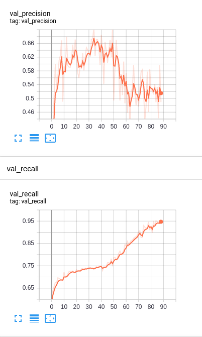

# FingerPaint
Hand tracking experiments

# What is this?
A few weeks ago I bought a cheap webcam for my online classes during pandemic.
This project is about using that cheap webcam to track hands. I intend for my other repos to be more stand alone projects,
but since I'm not really sure what the end goal is this one will be more of a living repo as I figure out what I want to do.

So far I've written an interface to connect models to my webcam and visualize the result as well as training a Yolo3 model to
detect hands (poorly, thus far)

## Yolo3
So far I have begun training Yolo3 from [this] repo on the [ego hands] dataset. The data is taken from google glass images (ego centric view) and hand annotated.
The image set is relatively small and not really suited for the POV I want to take images at (from my webcam atop my monitor).

This is the model after 49 epochs. After that it starts overfitting wildly and spits out some silly predictions.

On my 1080ti, 100 epochs took about 4.5 hours. 

As you can see it has decent recall (it can usually track the hand), but poor precision (lots of vaugely flesh colored things are detected as hands).

This is a clear example of overfitting. The model shown in the gif above was the epoch with the best F1 score.

*Make sure pytorch is built directly from source when using!* I had some stability issues on my machine when using a prebuilt binary
but your mileage may vary

## Requirements
+ pytorch
+ torchvision
+ cv2
+ numpy
+ Pillow

# More Ideas
+ Try yolo again with more data. I plan on ensembling a few datasets to capture hands from other perspectives than just
the ego centric view.

+ Implement an image augmentation pipeline that includes putting out of context hands from GANerated Hands in context with real images.

+ Pose estimation using the excellent [GANerated Hands](https://handtracker.mpi-inf.mpg.de/projects/GANeratedHands/GANeratedDataset.htm)
dataset.

+ Use the estimated position of hands and fingers to allow the user to "finger paint" as the name of this repo suggests

+ Build [Detectron2](https://github.com/facebookresearch/detectron2) on my machine and try MaskRCNN for the hand detection and Keypoint RCNN for the pose estimation.
While KeypointRCNN can also do the bounding box prediciton work that MaskRCNN provides, I don't have a dataset that really fits:
I have hands with keypoints out of context (GANerated Hands) and hands in context without keypoints (Ego Hands and the [Oxford Hands Dataset](http://www.robots.ox.ac.uk/~vgg/data/hands/))

+ Once I can get centroid tracking of hands good enough, track hands to emulate the rotation of a Nintendo Wii controller to play MarioKart
